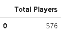
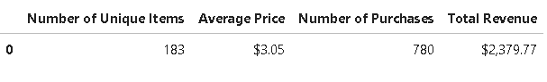
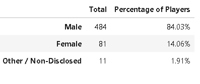
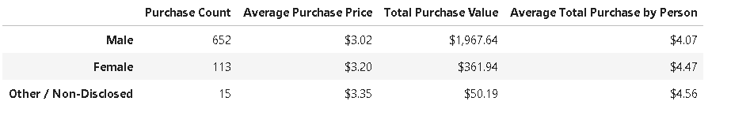
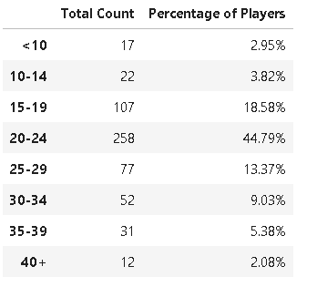
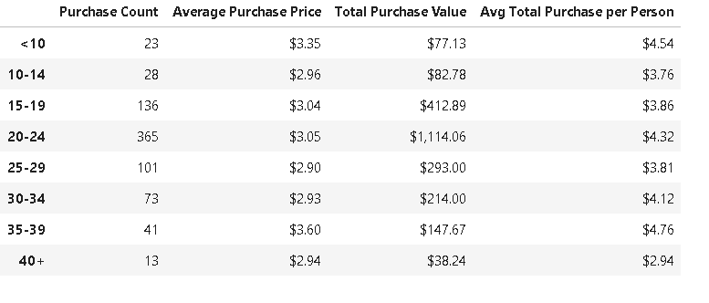
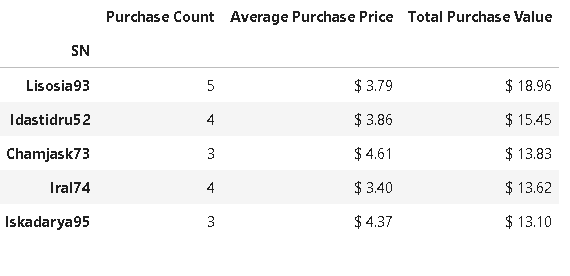
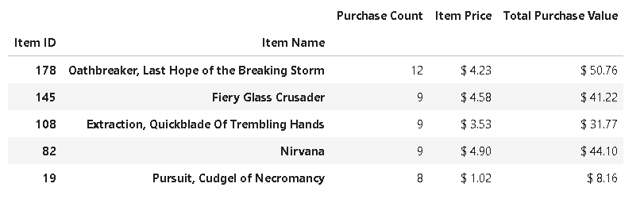
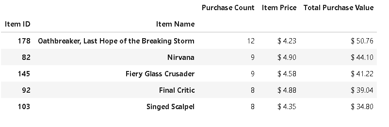

# Pandas-Challenge
Pandas Project

## Background

Heroes of Pymoli is a fictitious game that is free-to-play but players are encouraged to purchase optional items that enhance their playing experience. At the same time these optional items provides the company with revenue stream ( a monetization of the free game).

Below are some of the analysis generated to provide the company with some meaningful insights on Game purchasing data.

### Player Count

* Total Number of Players

_Analysis:_

Insight 1 - Of the 780 people playing the game, only 576 are actual players (74%) explaining that some of players are very active purchasing different options. It would be worthwhile to gather feedback from players who are not purchasing options more than once to understand that.

### Purchasing Analysis (Total)

* Number of Unique Items
* Average Purchase Price
* Total Number of Purchases
* Total Revenue

_Analysis:_

Insight 2- Based on the Purchasing Total details, on average, 4 purchases per items are happening. We can improve on this by having more data on the user and their feedback, likes etc.

### Gender Demographics

* Percentage and Count of Male Players
* Percentage and Count of Female Players
* Percentage and Count of Other / Non-Disclosed

_Analysis:_

Insight 3- Heroes of Pymoli game and other available options seems to be a Men’s game (84%) with certain class of females (14%) also showing interest. It would be worthwhile to investigate the cause and understand what can be done to improve the situation either by adding more options to attract other gender classes as well.

### Purchasing Analysis (Gender)

* The below each broken by gender
  * Purchase Count
  * Average Purchase Price
  * Total Purchase Value
  * Average Purchase Total per Person by Gender

_Analysis:_

Insight 4-Purchasing analysis by gender shows that Male have done maximum purchase worth 1967.64 dollars which is almost 83% of the total purchase. But interesting to see that average total purchase per person is highest for ‘Other’ category (4.56 dollars) along with Females (4.47 dollars). It would be beneficial for the company invest time and money to come up with options that can attract more female and other classes of gender as they are high potential categories.

### Age Demographics

* The below each broken into bins of 4 years (i.e. &lt;10, 10-14, 15-19, etc.)
  * Purchase Count
  * Average Purchase Price
  * Total Purchase Value
  * Average Purchase Total per Person by Age Group

_Analysis:_

Insight 5-Our game seems most popular among '20-24' age group with 44.79% followed by '15-19' and '25-29' group. This indicates that Heroes of Pymoli game is liked mostly by teen and young adults. It would be worthwhile to study more on more information on players to find out why other age-groups are not purchasing the options. If we have the data of players who are just using the free version of the game, we can do a comparative study to know similar trend is observed.

### Purchasing Analysis (Age)

* Bin the purchase_data data frame by age
* Run basic calculations to obtain purchase count, avg. purchase price, avg. purchase total per person etc. in the table below
* Create a summary data frame to hold the results
* Display the summary data frame

_Analysis:_

Insight 6-Purchasing analysis by age shows that maximum purchase was done by age-group 20-24 with 1114.06 followed by 15-19 group by 412.8 and 25-29 group by 293.00. But the average total purchase per person shows the highest for <10 group with 4.54 dollars. Hypothesis is that Heroes of Pymoli options are mostly purchased by young adults, and some kids <10 are also buying these options. With more available data, we can analyse the reasons on the cause of it. May be that some adults in those houses are already using these options resulting in kids in those homes also purchasing these options. Also the company or creators of the game should invest time and energy in exploring how the game can be made more popolar with age groups <10 group, 30-34 & 35-39 as they present the most potential (these age groups spend more per purchase than others).

### Top Spenders

* Identify the the top 5 spenders in the game by total purchase value, then list (in a table):
  * SN
  * Purchase Count
  * Average Purchase Price
  * Total Purchase Value

Insigt 7-Out of the 780 total purchases by 576 unique players, top purchases are not that high limiting to maximum of 5 number by individual players. It would be worthwhile to investigate the reason if we have the data of purchase also as that can help in understanding, if purchase habins are continuing or just once time purchase only. This can help in increasing the purchasing frequency and numbers per player.

### Most Popular Items

* Identify the 5 most popular items by purchase count, then list (in a table):
  * Item ID
  * Item Name
  * Purchase Count
  * Item Price
  * Total Purchase Value
 

Insight 8- Of the total purchases of 780, maximum purchase happened for one Item is only 12 for ‘Oathbreaker, Last Hope of the Breaking Storm’ followed by 9 numbers. It would be beneficial to investigate on least popular ones like 'Gladiator's Glaive', 'Crucifer' etc.

### Most Profitable Items

* Identify the 5 most profitable items by total purchase value, then list (in a table):
  * Item ID
  * Item Name
  * Purchase Count
  * Item Price
  * Total Purchase Value
 

Insight 9-Looks like top most popular items ( 'Oathbreaker, Last Hope of the Breaking Storm', 'Nirvana' ) are the maximum profitable ones also with a highest total purchase value of 50.76 dollars and 44.10 dollars respectively. It would be worthwhile to investigate on least popular items too by gathering more data on player's background, interests etc. Company can invest time and money on more interesting zonres of options to increase profitability.

