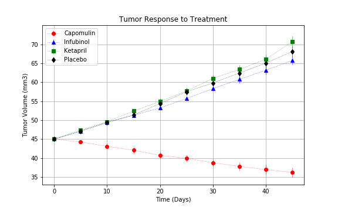
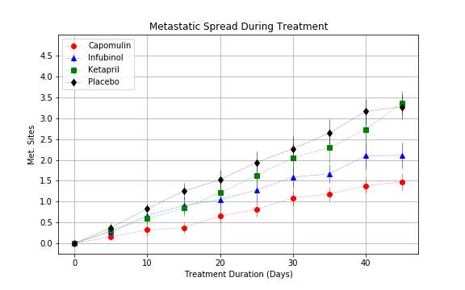
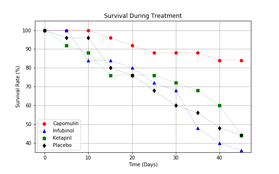
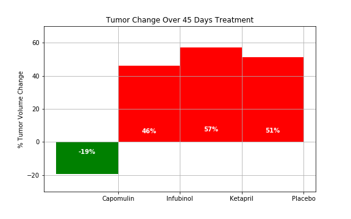

Python Visualization

## Background

##  Pymaceuticals Inc

Pymaceuticals Inc., a burgeoning pharmaceutical company based out of San Diego, CA. Pymaceuticals specializes in drug-based, anti-cancer pharmaceuticals. In their most recent efforts, they've since begun screening for potential treatments to squamous cell carcinoma (SCC), a commonly occurring form of skin cancer.

We have gathered complete data from their most recent animal study. In this study, 250 mice were treated through a variety of drug regimes over the course of 45 days. Their physiological responses were then monitored over the course of that time. My objective here is to analyze the data to show how four treatments (Capomulin, Infubinol, Ketapril, and Placebo) can be compared.

* Tumor Response to Treatment

Fig(1)

_Trends_: 

Based on Fig(1), Capomulin drug seems relatively most effective in reducing tumor volume by -19.4%, while all other drugs are showing increase in tumor growth in the treatment done for squamous cell carcinoma (SCC) at the end of 45 days treatment period. (Infubinol +46%, Ketapril +57% and Placebo +51%). It was also noticed that drug Ramicane is showing higher reduction in Tumor volume than Capomulin with -22% and so is a potential drug to compare with. 

So it might be beneficial to invest more time and money on research with Capomulin and Ramicane drugs to further improve the reduction in tumor volume.

* Metastatic Response to Treatment

Fig(2)

_Trends_:

Based on Fig(2), there seems to be an increase in Metastatic Sites for all drugs over a period of 45 days. However, Capomulin only shows an increase of 1.5 whereas other drugs Infubinol(2.1, Ketapril(3.36) and Pacebo(3.27). It's a notable fact that, 2 other drugs Ramicane and Stelasyn are showing an increase of Metastatic sites of only 1.25 and 1.72 only even though not considered for comparative study. So it's worthwhile to do further research on Ramicane and Stelasyn as both could be potential drugs for controlling Metastic sites along with Capomulin.

So it might be beneficial to invest more time and money on research with potential drugs like Capomulin and Ramicane to further improve the reduction in metastatic sites.

* Survival Rates

Fig(3)

Based on Fig(3), Capomulin shows highest survival rate with 85% whereas Infubinol(36%), Ketapril(44%) and Placebo(44%). Also another drug Ramicane is showing relatively good survival rate of 80%.  Even though there could be other contributing factors like overall health of the mice those are getting treated, pre-existing conditions etc, we don't have any data related to that.

So it could be worthwhile to invest more time and money on research with Capomulin drug to further improve the survival rates. 

_Trends_:

* Tumor change over 45 days Treatment

Fig(4)

_Trends_:

Based on the Fig(4), Capomulin shows a reduction of 19% whereas other drugs shows an increase in tumor at the end of 45 days treatment. (Infubinol +46%, Ketapril +57% and Placebo +51%). Also Ramicane which is not considred in this comparison, shows even better result with a reduction of 22%. 

So it might be beneficial to invest more time and money on research with Capomulin and Ramicane drugs to further improve the reduction in tumor volume.