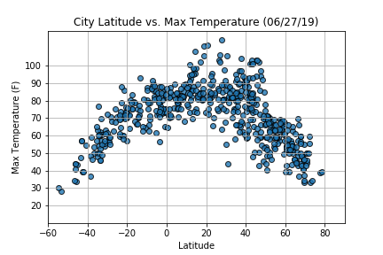
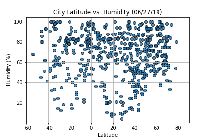
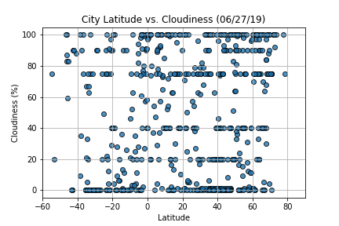
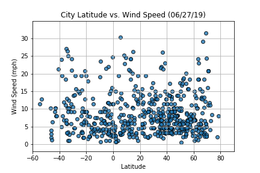
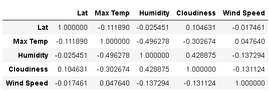
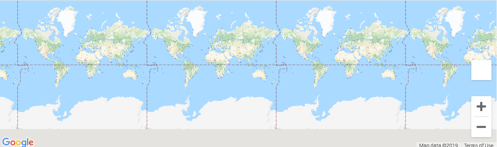

#  "What's the weather like as we approach the equator?"

Now, we know what you may be thinking: _"Duh. It gets hotter..."_

But, if pressed, how would you **prove** it?

## WeatherPy

In this example, I have created a script that will visualize the weather of 500+ cities across the world of varying distance from the equator. Following libraries have been used to accomplish this.
[simple Python library](https://pypi.python.org/pypi/citipy),
the [OpenWeatherMap API](https://openweathermap.org/api)
[geographic coordinate system](http://desktop.arcgis.com/en/arcmap/10.3/guide-books/map-projections/about-geographic-coordinate-systems.htm).

The objectiveof this challenge is to build a series of scatter plots to showcase the following relationships:

* Temperature (F) vs. Latitude
* Humidity (%) vs. Latitude
* Cloudiness (%) vs. Latitude
* Wind Speed (mph) vs. Latitude

This Jupyter notebook has,

* Randomly select **at least** 500 unique (non-repeat) cities based on latitude and longitude.
* Perform a weather check on each of the cities using a series of successive API calls.
* Include a print log of each city as it's being processed with the city number and city name.
* Save both a CSV of all data retrieved and png images for each scatter plot.

### Trend/Analysis

* Latitude vs. Temperature

_As we move away from equator ( 0 degrees latitude), northwards or southwards, temperature on the whole decreses with highest temp at 115 degrees Farenheit and lowest at 26 degrees. But we can see that temperatures between 20 and 40 degrees latitude reporting highest temperatures and not at equator.This might be because data is not collected at the same local time from all cities but at US CST. This means it could be day, night, noon or evening etc at these cities. More accurate would've been to collect data from different cities for the same local time. Like 12noon local time from all cities._

* Latitude vs. Humidity

_Unable to see a specific trend for Humidity as latitude changes and high and low values everywhere as we go away from the equator. Humidity is the amount of water vapour in the air and ideally as temperature increases, relative humidity decreases. But when this data was collected, time of different cities are different and so humidity level could be different. Like less humidity in the air in the noon Vs more in the morning. But the local weather conditions like cloudiness, wind etc can affect the humidity and also presence of water bodies nearby._

* Latitude vs. Cloudiness

_On the whole, we see scattered clouds as we go north or south from equator. No specific trend is seend in Cloudiness but see high Cloudiness near equator also as we go away from 0 degrees latitude. High humidy indicators could be linked with cloudiness also._

* Latitude vs. Wind Speed

_It doesn't seem like a windy day as the highest reported is less than 35mph. Wind speed, a factor of Air pressure and can change based on temperature increase or decrease. Also during the days, typically more windy than nights but the data was collected at a time when it's day time in Austin and evening in most of the places close to equator. So basically do not see any specific trend for wind speed for this day as we move away from 0 latitude but on the whole not a windy weather._

_Basically no strong correlation can be found between latitude and other weather inidcators for today. A slight positive correlation (0.428875) can be found between Humidy and Cloudiness and a slight negative correlation between Maximum Temperature and Humidity (-0.496278)._

* Heatmap of Temperatures across the cities.

