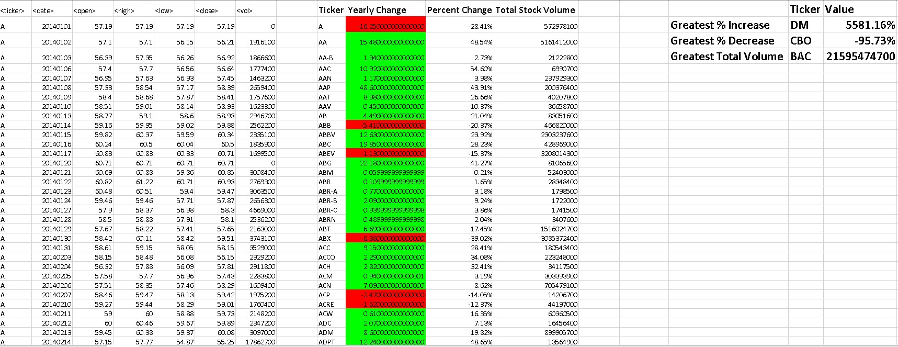
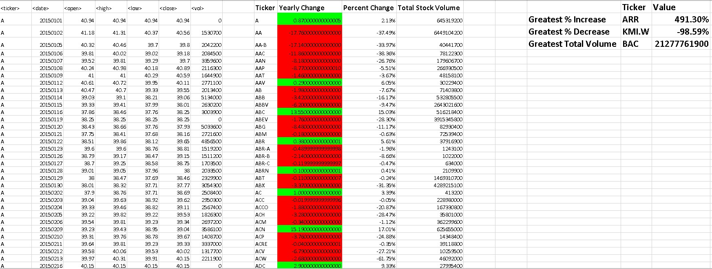
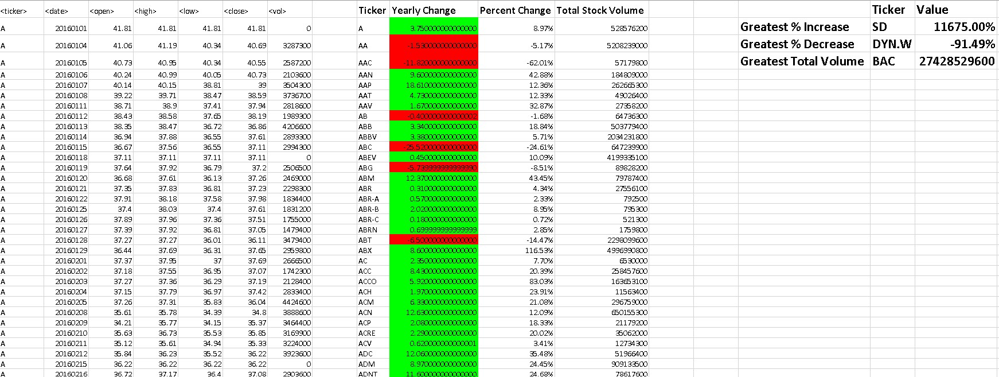

# Unit 2 | Assignment - The VBA of Wall Street

## Background

This VBA assignment is to analyze real stock market data to generate insights on Greatest percentage increase, Greatest percentage decrease and Total Volume of various Stocks across the years 2014 to 2016.

### Files

* [Stock Analysis Report Generator Script](Resources/Stock_Analysis_Report_Generate.vb) - This is the main script to Generate Stock Market Analysis Report. This file consists of 2 sub-routines and to generate the report, **IterateSheets()** is the one to run as it calls other sub-routine for every worksheet in the workbook.

* [Resetting output Script](Resources/Reset_Output.vb) - This script helps to reset the output generated if required before another run. This file consists of 2 sub-routines and and to reset, **ResetSheet()** is the one to run as it calls other sub-routine for every worksheet in the workbook and clears the results.

### Stock market analyst
**Year 2014 Report**

**Year 2015 Report**

**Year 2016 Report**

Note:

The data provided in .xls format for Multiple Year Stock Data, already had opening balance and closing balance data rounded to 2 decimal places and that has prevented from having the **Yearly Increase** not showing accurate results with exact precision with respect to decimals with respect to the provided image. But my Greatest percentage Increase, Decrease and Total volume matches the values as in the image provided.